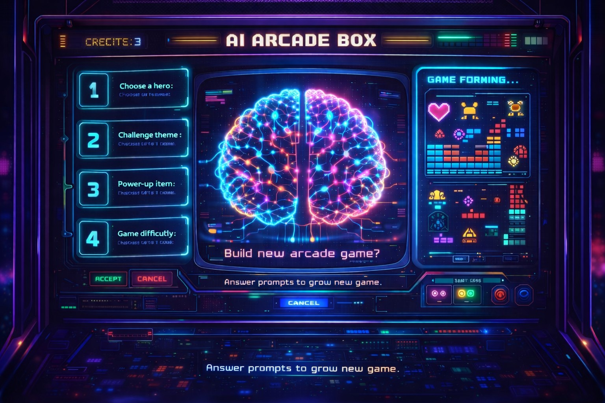

# AI Arcade

Local Raspberry Pi web app that:

- asks OpenAI for a fresh set of 4 two-answer questions on startup
- lets the player answer with the arcade controls, with keyboard and mouse fallbacks available too
- asks OpenAI for a brand-new arcade game based on those answers
- loads the returned single-file game directly in the browser
- can also run as a static GitHub Pages site for replaying saved games from the library
- supports a global reset combo: hold `UP + Button 1 + Button 2` for 4 seconds

## Stack

- Node.js built-in HTTP server
- vanilla HTML, CSS, browser Gamepad API, and keyboard/mouse fallback bindings
- OpenAI Responses API from the local server so the API key never sits in the browser

## Setup

You can either run it on your own server with an OpenAI API key so you can generate new games, or try the saved games on GitHub Pages without game generation.

1. Use Node 20+.
2. Create a `.env` file in the project root.
3. Add at least:

```env
OPENAI_API_KEY=your_api_key_here
OPENAI_QUESTION_MODEL=gpt-5.4-mini
OPENAI_GAME_MODEL=gpt-5.4
PORT=3000
```

4. Start the app:

```bash
npm start
```

5. Open `http://localhost:3000`.

## Raspberry Pi notes

- The browser UI is designed around the arcade controller, but arrow keys or `WASD` also map to directions, `Enter` maps to Button 1, `Shift` maps to Button 2, `Esc` returns to the start menu, and mouse buttons `1` and `2` also map to Button 1 and Button 2.
- The frontend reads the controller through the browser Gamepad API and mirrors the same digital inputs to keyboard and mouse fallback bindings.
- By default, Button 1 is gamepad button index `0` and Button 2 is index `1`.
- The joystick uses either the left stick axes or standard d-pad button mapping if the controller exposes buttons `12-15`.
- Generated games receive controller state through a host-provided `window.arcadeInput` object inside the iframe.

## GitHub Pages

- The repo root now includes a static `index.html` entry point so GitHub Pages can serve the saved library without the local Node server.
- On GitHub Pages, game generation is disabled unless the app can reach a local API with an `OPENAI_API_KEY`, but saved games in `data/library/` remain playable in the browser.
- GitHub Pages demo: [AI Arcade Box on GitHub Pages](https://grigtod.github.io/AIArcadeBox/)

## Contributing

If you run the app, generate a really cool game, and want to share it back, feel free to open a pull request and I will happily take a look and merge it in.

All help to expand the app further is welcome, whether that is new saved games, polish, fixes, or bigger feature ideas.

## Verification

Without a live API key, you can still check the server syntax:

```bash
npm run check
```
